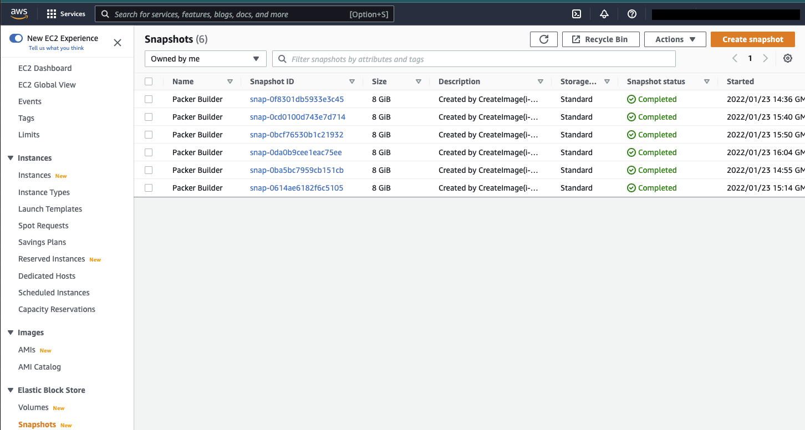

# AWS Free Tier и Packer Tutorial

# Предыстория

Когда я только знакомился с AWS по youtube плейлисту, я смастерил `VPC` в двух `AZ` с несколькими подсетями. Один из типов подсетей был private - с `nat-gateway`, в курсах забыли сказать, что они не входят во фритир. За пару дней за 2 гейта накапало около **$6**. Было обидно, я поставил биллинг аларм.

:::info #!NOTE
Тот самый курс от [Курс ADV-IT](https://www.youtube.com/watch?v=8jbx8O3wuLg&list=PLg5SS_4L6LYsxrZ_4xE_U95AtGsIB96k9)
:::

# История

Совсем недавно я учился (на котиках) созданию артефактов с помощью [packer](./blog/selfmade-vagrant-box). После тренировки в AWS я со спокойной душой в console нужного региона убил все `AMI` и пошел дальше.

Неделю спустя в почте заметил очередное письмо от AWS (мне иногда на личный gmail аккаунт приходят от них billing репорты, всегда пустые, и приглашения не [re:invent](https://reinvent.awsevents.com/)).

Увидел что я потратил 85% _"фри-тирного"_ места под снэпшоты ebs дисков.

:::info
[AWS Free Tier](https://aws.amazon.com/free/?all-free-tier.sort-by=item.additionalFields.SortRank&all-free-tier.sort-order=asc&awsf.Free%20Tier%20Types=*all&awsf.Free%20Tier%20Categories=*all) - тут можно прочитать сколько вам в месяц выделяется того или иного ресурса бесплатно в рамках фри-тира.
:::

Ага - из-за негодяя `packer`-а помимо `AMI`-шек создаются еще и такие сущности.

:::tip Мораль
- пермым делом во фри-тире сделайте не рутового пользователя, вторым настройте [биллинг алерты](https://www.youtube.com/watch?v=XNeAH4dch0g) (я бы поставил трешхолд на 50% - в моем случае бюджет таял быстро). 
- Авторам видео / гайдлайнов, конечно, стоило бы указывать, что это не входит во фри-тир - или входит, но слабые лимиты.
:::
<!--truncate-->
