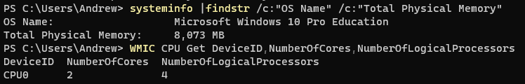

# Vagrant - DevOps Environment

# Inspiration

Буквально недавно [писал](blog/selfmade-vagrant-box) про сборку `Vagrant`-а, **доделалъ** :tada:, в двух версиях:

- в серверной работаем через ssh 
- и gui, установлены разные desktop приложения :computer:

<!-- TODO: codeserver? -->
[](https://asciinema.org/a/58jLHlUsCZA63uGjIClQcX5r0)

:::info "Этапы"

- [Сборка Packer-ом](https://github.com/karma-git/playground/tree/master/environment/vagrant/build)
- [Ansible](https://github.com/karma-git/playground/tree/master/ansible)
- [Vagrant Cloud](https://app.vagrantup.com/karma-kit)
- [Vagrantfile examples](https://github.com/karma-git/playground/tree/master/environment/vagrant/examples)

:::

Или схематично:

import Mermaid from '@theme/Mermaid';

<Mermaid chart={`
  sequenceDiagram
    participant Packer
    participant Vagrant
    participant Ansible
    Packer->>Vagrant: Launch tmp VM
    Note right of Vagrant: !NOTE: at low level Vagrant uses Virtualbox API
    Vagrant->>Ansible: Configure tmp VM
    Ansible-->>Vagrant: Done!
    Vagrant-->>Packer: Done!
    %% loop Artifact
    %%     Ansible->>Packer: Create Vagrant box from current VM state.
    %% end
    note over Packer: Creates Vagrant box from current VM state.
    note over Packer: Releases the Vagrant box on Vagrant Cloud.
`}/>

# Установка на Windows 

Проверьте ресурсы вашей host OS:

CPU
```powershell
WMIC CPU Get DeviceID,NumberOfCores,NumberOfLogicalProcessors
```
Версию OS и общий объем RAM:
```powershell
systeminfo |findstr /c:"OS Name" /c:"Total Physical Memory"
```


:::tip "Рекомедованные ресурсы"
- 2 vpcu
- 4Gi RAM
:::

Вам потребуется:
- [VirtualBox](https://www.virtualbox.org/wiki/Downloads)
- [Vagrant](https://www.vagrantup.com/docs/installation)

# VirtualBox Guest Additions

> [6.4. Installing the VirtualBox Guest Additions](https://docs.oracle.com/cd/E36500_01/E36502/html/qs-guest-additions.html)

:::info

Это, пожалуй, самое больное в использовании virtualbox - открыть гую на весь экран. Тут я не буду вам давать никаких обещаний, могу лишь накинуть идеи как вам с этим справиться:

:::

## vbguest vagrant plugin

:::danger
У меня сработало лишь один раз :skull:
:::

```shell
vagrant plugin uninstall vagrant-vbguest
vagrant destroy -f
vagrant up
vagrant plugin install vagrant-vbguest
vagrant vbguest --do install
```

## ansible galaxy

Используйте мой [пример](https://github.com/karma-git/playground/tree/master/environment/vagrant/examples/karma-kit-devops-gui) - Guest Additions установит ansible роль. 

:::caution

Гарантию, что у вас все сработает дать невозможно, но скорее всего понадобятся минимальные телодвижения.

:::

## Секретный вариант

Всегда можно погуглить / посмотреть ютуб на тему как сделать `Virtualbox` на весь экран :wink:

Удачи и да прибудет с вами сила!

:::tip

Если не смотрели, исправьтесь:

<div class="video-wrapper">
  <iframe  height="540" frameborder="0" allowfullscreen width="50%" src="https://www.youtube.com/embed/n1F_MfLRlX0" frameborder="0" allowfullscreen></iframe>
</div>

:::

<!--truncate-->
