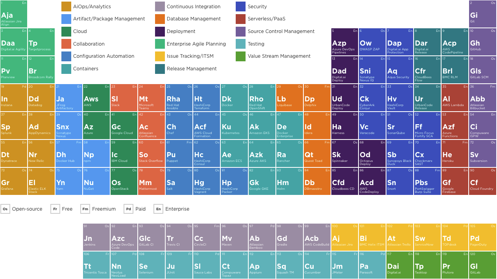
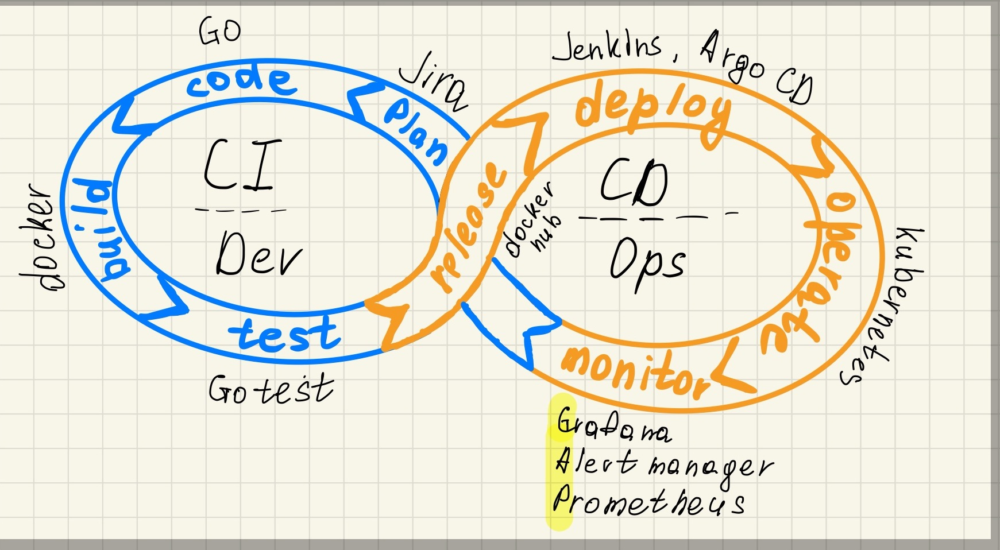

# Argo CD: Let's Get Stuff Deployed

export const Highlight = ({children, color}) => (
  <span
    style={{
      backgroundColor: color,
      borderRadius: '2px',
      color: '#fff',
      padding: '0.2rem',
    }}>
    {children}
  </span>
);

import Tabs from '@theme/Tabs';
import TabItem from '@theme/TabItem';

## Revising

### Зависимости



:::info
Source: https://digital.ai/periodic-table-of-devops-tools/
:::


| 1. Cloud :cloud: | 2. Docker :whale: | 3. Orchestration :boat: | 4. CI/CD :rocket: | 5. K8s GitOps operators :octopus: |
| ------------- | -------------- | -------------------- | -------------- | ------------------------------ |
| AWS           | Docker Engine  | Kubernetes           | Jenkins        | Argo CD                        |
| Azure         | CRI-O          | Docker Swarm         | GitLab CI/CD   | Flux CD                        |
| others        | others         | others               | others         | others                         |

### Cloud :cloud:

<Highlight color="#25c2a0">AWS</Highlight> public cloud - это платформа, где можно получить доступ к вычислительным ресурсам по требованию.

### Docker :whale:

:whale: собирает наше приложение, написанное на любом ЯП с использованием любых фреймворков, в легковесную коробку :package: , которую можно легко доставить куда угодно и так же легко запустить наше приложение, находящееся в этой коробке :runner:

<Highlight color="#25c2a0">Docker Inc.</Highlight> сделали эту технологию доступной для широкий масс и захватили mindset инженеров.

---

Но современные приложения состоят из нескольких микросервисов: front-end, back-end, database и т.д., и docker не отвечает на вопросы как этим удобно пользоваться и масштабироваться.

:::info
`docker-compose` - частично решает вопрос удобства использования докер, но лишь в локальных средах.
:::

### Orchestration :boat:

:::info
[Cloud Native Computing Foundation (CNCF)](https://www.cncf.io/) serves as the vendor-neutral home for many of the fastest-growing open source projects, including Kubernetes, Prometheus, and Envoy.
:::

**Почему K8s?**

<Highlight color="#25c2a0">Kubernetes (k8s)</Highlight> - фреймворк для работы с распределенными системами:

- проект CNCF
- удачная архитектура - каждый компонент изолирован от другого
- комьюнити (85к звезд)
- дефакто - стандарт отрасли

- декларативный
- автоматически осуществляет балансировку нагрузки
- self-healing - может перезапустить отказавшие контейнеры, выполнять различные проверки и т.д.

<Mermaid chart={`
  flowchart TB
    api((kube-api))
    subgraph workers
        n1[node1]
        n2[node2]
        nx[nodeX]
    end
    
    client --> api
    master --> api
    s[(Storage)] --> api
    workers --> api
`}/>

:::tip вопрос
Какой из компонентов **Kubernetes** управляет всеми другими?
:::

### CI/CD 🚀 💿



<Highlight color="#164a6f">CI</Highlight> - непрерывная интеграция, частые слияния с основной веткой разработки.

---

<Highlight color="#f57e0f">CD</Highlight> - непрерывная доставка - новая версия приложения (артефакт) создается при каждом слияние, но развертывание все еще происходит вручную.

---

<Highlight color="#f57e0f">CD</Highlight> - непрерывное развертывание - говорит о том, что после сборки артефакта он автоматически развертывается на одно из наших окружений.

---

:::caution
CI/CD/CD - сильно зависит от вашего GitXXX Flow.
:::

import Mermaid from '@theme/Mermaid';

<Mermaid chart={`
  flowchart TB
    subgraph deploy
        d2[canary]
    end
    subgraph delivery
        d1[docker-registry]
    end
    subgraph test
        t1[pytest]
        t2[coverage]
        t3[smoke]
    end
    subgraph build
        b[docker]
    end
    subgraph lint
        l1[flake8]
        l2[black]
    end
`}/>

## GitOps, Argo CD

:::tip вопрос
- Что такое Infrastructure as a Code (IaC)?
- В чем разница императивной и декларативной парадигм?
:::

### Argo CD workflow

<Mermaid chart={`
  flowchart TD
    subgraph application [app repo]
        dev[developer]
        dev -- commit changes --> app[app repo]
        app -- CI pipeline --> ci[build and push image to registry]
    end
    subgraph infrastructure [infra repo]
        re[release engineer]
        re -- commit changes --> infra[infra repo]
    end
    subgraph env [k8s]
      argo -- continuously pull --> infra
      argo -- sync desired state --> k8s[k8s cluster]
    end
`}/>

### GitOps

<Highlight color="#1877F2">GitOps</Highlight> - это эволюция <strong>IaC</strong>, где <strong>Git</strong> является единственным источником истины состояния нашей инфрастуктуры, реализует непрерывное развертывание.

- прозрачность: аудит / передача экспертизы / документация / Git Workflow (перенос опыта совместной разработки для управления инфрастуктурой)
- исправление ошибок - `git revert`
- легкость настройки доступов

### GitOps vs IaC(CI_OPs)

|...                   | GitOps            |IaC                                  |
|----------------------|-------------------|-------------------------------------|
|Paradigm :moyai:             | `Pull` (_Declarative_) | `Push` (_Imperative_)                     |
|Code Storage :bank:          | Git               |may not be in Git                    |
|Code Changes Process :raising_hand: | GitXXX flow       |GitXXX flow or manual                |
|Infrastructure Updates :wrench:  | **Automated**         |CI or manual                         |
|Access :guardsman:                | Operator to git   |CI or operator to K8s api            |
|Infra Changes :collision:        | Git               |helm rollback,upgrade,delete and etc.|

### Argo CD

:::note
**controller** = **operator** = **agent**
  
**K8s**, это лишь один из примеров использования GitOps и cloud native приложений
:::

<Highlight color="#1877F2">GitOps</Highlight> оператор для <strong>K8s</strong>.

- проект сертифицирован CNCF
- использует Git как источник истины, может автоматически синхронизировать состояние кластера с Git
- декларативный (plain yaml, plain json, kustomize, helm, jsonnet)
- controller + CRD
- SSO + RBAC


## Demo

<div class="video-wrapper">
  <iframe  height="540" frameborder="0" allowfullscreen width="100%" src="https://www.youtube.com/embed/VfC4d0uLWS4" frameborder="0" allowfullscreen></iframe>
</div>

:::note
Код из demo: https://gitlab.com/publi8/
:::

### Application


<Tabs defaultValue="dockerfile">
<TabItem value="py" label="FastApi">

```py
from fastapi import FastAPI

app = FastAPI()


@app.get("/")
def read_root():
    return {"Hello": "World"}


@app.get("/version")
def get_version():
    return {"version": "demo-1"}
```
</TabItem>
<TabItem value="dockerfile" label="Dockerfile">

```dockerfile
FROM python:3.10.0-alpine3.14

COPY ./requirements.txt ./requirements.txt

RUN pip install --no-cache-dir -r requirements.txt

RUN addgroup --gid 10001 app \
  && adduser \
    --uid 10001 \
    --home /home/app \
    --shell /bin/ash \
    --ingroup app \
    --disabled-password \
    app

WORKDIR /home/app

USER app

COPY ./ /home/app

ENTRYPOINT ["/usr/local/bin/uvicorn"]
CMD ["main:app", "--reload", "--host=0.0.0.0", "--port=8000"]
```
</TabItem>
</Tabs>

### Kubernetes Environment

<Tabs defaultValue="app">
<TabItem value="app" label="Application">

```yaml {12-17}
---

kind: Application
apiVersion: argoproj.io/v1alpha1
metadata:
  name: demo-app
  namespace: argocd
  finalizers:
    - resources-finalizer.argocd.argoproj.io
spec:
  project: default
  source:
    repoURL: https://gitlab.com/publi8/demo-environment.git
    targetRevision: main
    path: ./demo-app
    directory:
      recurse: true
  destination:
    namespace: default
    server: https://kubernetes.default.svc
  syncPolicy:
    automated:
      selfHeal: true
  revisionHistoryLimit: 3
```
</TabItem>
<TabItem value="deploy" label="Deployment">

```yaml {31}
---
apiVersion: v1
kind: Service
metadata:
  name: demo-app
  namespace: default
spec:
  selector:
    app: demo-app
  ports:
  - port: 8000
    targetPort: 8000
...
---
apiVersion: apps/v1
kind: Deployment
metadata:
  name: demo-app
  namespace: default
spec:
  selector:
    matchLabels:
      app: demo-app
  template:
    metadata:
      labels:
        app: demo-app
    spec:
      containers:
      - name: demo-app
        image: registry.gitlab.com/publi8/demo-application
        resources:
          requests:
            cpu: "20m"
            memory: "32Mi"
          limits:
            cpu: "30m"
            memory: "64Mi"
        ports:
        - containerPort: 8000
```
</TabItem>
</Tabs>

### Environment Init

#### Argo UI
Создаем неймспейс для argo, добавляем чарт и устанавливаем релиз.

```shell
kubectl create ns argocd
helm repo add argo https://argoproj.github.io/argo-helm
helm upgrade --install argocd argo/argo-cd --namespace argocd
```
Ждем пока поднимутся поды argocd:
```shell
watch kubectl get pod -n argocd
```
В отдельном терминале делаем pf argo ui:
```shell
kubectl port-forward service/argocd-server -n argocd 8080:443
```
Смотрим пароль от argo ui:
```shell
kubectl -n argocd get secret argocd-initial-admin-secret -o jsonpath="{.data.password}" | base64 -d
```
**Argo UI** - http://127.0.0.1:8080

#### App UI

Создаем `Argo Application`

```shell
kubectl create -f demo-app.yml
watch kubectl get pod -n default
```
В отдельном терминале делаем pf app ui:
```shell
kubectl port-forward service/demo-app -n default 8000:8000
```
Делаем запрос к сервису:
```json
$ http http://127.0.0.1:8000/version
HTTP/1.1 200 OK
content-length: 20
content-type: application/json
date: Tue, 08 Feb 2022 05:03:42 GMT
server: uvicorn

{
    "version": "demo-1"
}
```
Удалим все деплойменты и убедимся, что арго вернет все как было:
```shell
kubectl -n default delete deploy --all
```

#### Example Update

- обновляем приложение
- меняем тег образа в deployment-е и коммитим изменения
Приложение обновилось:
```json
$ http http://127.0.0.1:8000/version
HTTP/1.1 200 OK
content-length: 46
content-type: application/json
date: Tue, 08 Feb 2022 05:14:42 GMT
server: uvicorn

{
    "project": "ArgoCD - Demo",
    "version": "demo-1"
}
```

## Conclusion

<details>
  <summary>Links</summary>

GitOps
- https://www.gitops.tech/
- https://about.gitlab.com/topics/gitops/
- https://www.weave.works/technologies/gitops/
- https://express42.com/news/difference-between-gitops-and-iac/
- video [Nana gitops](https://www.youtube.com/watch?v=f5EpcWp0THw)
- video [d.stolyarov - gitops](https://www.youtube.com/watch?v=n12xQNWhRdw )

ArgoCD:
- https://argo-cd.readthedocs.io/en/stable/
- video [Argo CD Demo](https://www.youtube.com/watch?t=1m4s&v=aWDIQMbp1cc&feature=youtu.be) - argo docs
- video [Nana Argo CD](https://www.youtube.com/watch?v=MeU5_k9ssrs)

CI/CD:
- [CI/CD/CD](https://humanitec.com/blog/continuous-integration-vs-continuous-delivery-vs-continuous-deployment)

</details>
