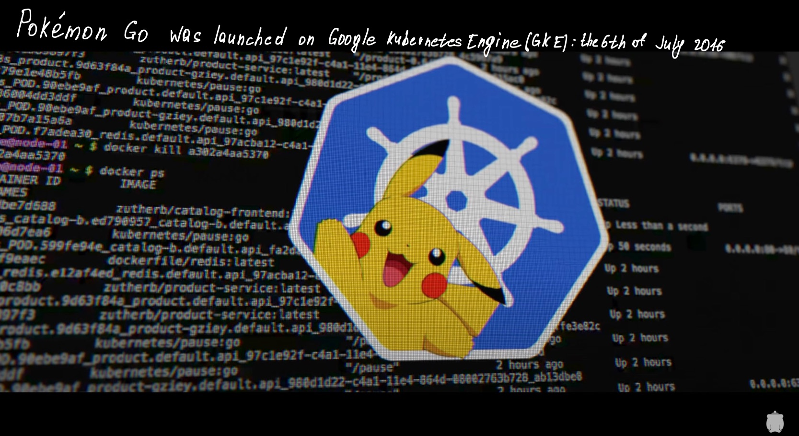

import Mermaid from '@theme/Mermaid';

> **Long story short**: Open Source is most successful when it's played as a *positive sum* game.

videos, participants 

  <iframe  height="540" frameborder="0" allowfullscreen width="100%" src="https://www.youtube.com/embed/BE77h7dmoQU" frameborder="0" allowfullscreen></iframe>

  <iframe  height="540" frameborder="0" allowfullscreen width="100%" src="https://www.youtube.com/embed/318elIq37PE" frameborder="0" allowfullscreen></iframe>

- [Brendan Burns](https://www.linkedin.com/in/brendan-burns-487aa590/) - Corporate Vice President at Microsoft
- [Brian Grant](https://www.linkedin.com/in/bgrant0607/) - Distinguished Engineer at Google
- [Craig McLuckie](https://www.linkedin.com/in/craigmcluckie/) - VP R&D VMware
- [Joe Beda](https://www.linkedin.com/in/jbeda/) - Principal Engineer VMware
- [Tim Hockin](https://www.linkedin.com/in/tim-hockin-6501072/) - Principal SW Engineer, k8s, GKE, GCP
- [Ville Aikas](https://www.linkedin.com/in/villeaikas/) - Founder at Chainguard

:::caution "from author"
Немного непонятно кто действительно стоял у самых истоков k8s, в документальном фильме Брайан [говорит](https://youtu.be/BE77h7dmoQU?t=976), что это были Брендон, Джо и Вилли. В [wiki](https://ru.wikipedia.org/wiki/k8s) - Брендон, Джо и Крейг. Кажется, что проще присвоить это достижения всем инженерам :point_up: и это не будет неправдой.
:::

- [Arnaud Porterie](https://www.linkedin.com/in/aporterie/) - ex Docker Inc Core Engineer
- [Chris Aniszczyk](https://www.linkedin.com/in/caniszczyk/) - CTO CNCF
- [Clayton Coleman](https://www.linkedin.com/in/claytoncoleman/) - Senior Distinguished Engineer at Red Hat
- [Eric Brewer](https://www.linkedin.com/in/eric-brewer-1031254/) | [wiki](https://en.wikipedia.org/wiki/Eric_Brewer_(scientist)) - VP Infrastructure & Google Fellow, Professor at UC Berkeley.
- Kelsey Hightower | [twitter](https://twitter.com/kelseyhightower/status/483644084821557250) - Stuff Developer Advocate, GCP
- [Chen Goldberg](https://www.linkedin.com/in/goldbergchen/) - Vice President Of Engineering at Google
- Solomon Hykes - Docker Inc. Founder and CTO
- and many others ...

## :cloud: The 2013

В 2013 году каждая компания - это интернет компания. Каждая из них находятся под влиянием DevOps методологии, стремится к автоматизации и не хочет иметь дело с `pure` виртуализацией и серверами. Их основная цель - Infrastructure as a Service aka :cloud:.

В тоже время AWS уже стал лидером на рынке облачных вычислений. Компании вроде Google и Microsoft тоже хотят выйти на этот рынок, но понимают, что сильно отстают. Google чувствует, что ему необходимо перенести свою экспертизу в облако, необходим некий *геймченджер*.

details

:::note
Gartner - исследовательская и консалтинговая компания, специализирующаяся на рынках информационных технологий. Прочитать об их деятельности и об **Magic Quadrant(MQ)** можно [тут](https://ru.wikipedia.org/wiki/Gartner).
:::

| YY | top3 | MQ |
| ---- | ---- | --- |
| [2013](https://cloudmania2013.com/2013/08/29/gartner-iaas-magic-quadrant-2013/) | AWS,CSC,nil |  |
| [2015](https://cloudmania2013.com/2015/05/27/gartner-iaas-magic-quadrant-2015/) | AWS,Azure,nil |  |
| [2017](https://www.51sec.org/2018/08/11/gartner-magic-quadrant-for-cloud-infrastructure-as-a-service-worldwide-2017-2016-2015-2014-2013-2012/) | AWS,Azure,GCP |  |
| [2021](https://www.gartner.com/doc/reprints?id=1-271OE4VR&ct=210802&st=sb)| AWS,Azure,GCP|   |

**k8s as a Service**:

|Vendor|Service|Release|
|AWS|Elastic k8s Service (EKS)|June 2018|
|Azure|Azure k8s Service (AKS)|June 2018|
|GCP|Google k8s Engine (GKE) |~ summer 2015|

## :whale: Docker did changed the world

Что касается контейнеров - это не новая технология. О её существовании знали, но это была некая секретная информация, доступная лишь ~ 10% компаний на рынке (Google, Uber, Heroku, etc.). Также остальная часть компаний не умело в High Load в production-е, им было сложно масштабировать приложения.

Docker сделал контейнеры очень простыми и доступными, с возможностью получить моментальную выгоду. :whale: - это инструмент, который элегантно решает свою маленькую задачу по *упаковке* и *доставке* приложений. Docker был обречён на успех. Проблема упаковки и доставки была решена, но что дальше? Как насчет :rocket: деплоймента и оперирования?

details

:::note
- Docker bridging gap between **Dev** and **Ops**
- Ты можешь заниматься приложением и не париться про окружению, запустить приложение локально, в ДЦ, в облаке.
:::

  <iframe  height="540" frameborder="0" allowfullscreen width="100%" src="https://www.youtube.com/embed/3N3n9FzebAA" frameborder="0" allowfullscreen></iframe>

## :boat: Kubernetes (k8s) - yet another orchestration tool

:::note
k8s был бы невозможен без успеха Docker.
:::

У нас есть клауд (компьютер), а как сделать эту машину полезной? Нужна Developers Platform.

Стратегия состояла в том, чтобы сделать новую платформу для облаков, вдохновленную Borg-ом.
Эта технология должна была стать лидером индустрии в своем сегменте (evaluation of `GKE`) для запуска на ней `workloads`, но Google был недостаточно большим, чтобы сделать это в одиночку. Ему было необходимо много *fellow travelers* вокруг этой технологии. Поэтому было принято решение сделать его *open source* проектом.

За работу взялись несколько инженеров, у кого-то была экспертиза в облаке, у кого-то в Borg-е. Ребята рассказывали идею коллегам, а получилось обратить на нее внимание одного из VP Google в поездке на автобусе. Некоторое время заняло корпоративное противостояние `за` и `против` *Open Source*.

За некоторое временя до *Dockercon*, который прошел в июне 2013, к проекту подключился Крейг из *RedHat*, один из первых внешних контрибьютеров. Он внес большой вклад в чистоту `Go` кода. Прототип успели подготовить к конференции.

Kelsey Hightower - k8s explanation, Promise Theory

Давайте представим, что приближаются праздники, и вы хотите отправить подарок близкому человеку. Вы приходите на почту, говорите, что хотите отправить вещи. Вам скажут, что смогут доставить вещи, но в таком виде их можно потерять. Мы не хотим потерять книги, драгоценности или деньги. Поэтому нам нужно положить их в коробку. Расширим аналогию и представим просто конверт. Стоимость отправки конверта из пункта `A` в пункт `Б` будет зависеть от разных факторов: размера, веса и т.д. Но что бы вы ни положили в конверт - почте это не важно.

Ключ к доставке - указание адресата. Как он будет доставлен, с какими сложностями почта может столкнуться при доставке - вас не интересует. Почта абстрагирует вас от этих проблем. Вы просто даёте конверт, говорите адрес, платите деньги и они вам обещают, что доставят его в течении 2-3 дней. Машина может сломаться, доставщик может заболеть, что у годно может случиться, но они обещают, что доставят его за 2-3 дня. Как они это будут делать - не важно. Это `Promise theory`.

Задача k8s-а - убедиться, что приложение работает. Точно так же, как задача почты убедиться, что письмо продолжает следовать к пункту назначения. k8s - абстракция над инфрастуктурой. Разработчикам нужно упаковать свое приложение в коробку, дать адрес, и если они могут позволить себе доставку - приложение будет запущено.

## "Project Seven" - logo, codename 

:::note
Naming is the hardest problem in computer science world:
:::

Однажды, будучи за рулём, Крейг подумал, что k8s это **пилот**. Ребята просто подыскали вариант этого [слова на другом языке](https://en.wiktionary.org/wiki/%CE%BA%CF%85%CE%B2%CE%B5%CF%81%CE%BD%CE%AE%CF%84%CE%B7%CF%82).

Дизайнеров Google не ограничивали в создании логотипа (это ведь open source project). Но, в итоге, логотип сделал Тим - у него было образование в дизайне. У руля сделали 7 граней, чтобы не терять связь с кодовым названием проекта.

## Dockercon 2014, k8s announcement

В день проведения конференции репозиторий k8s сделали публичным. На самой конференции различные компании / стартапы объявили о своих решениях оркестрации контейнеров (около 5-6).
У всех в голове была одна и та же идея.

details

|tool|company|
|----|-------|
|Mesos|RedHat|
|Docker Swarm|Docker Inc.|
|Tupperware|Facebook|
|k8s|Google|

> Хорошая [статья на habr](https://habr.com/ru/company/vk/blog/543232/) по системам оркестрации.

---

Это очень интересно посмотреть, даже если вы отлично знаете k8s. В этой презентации я нашел лучшее объяснение того, что такое `Pod`

  <iframe  height="540" frameborder="0" allowfullscreen width="100%" src="https://www.youtube.com/embed/YrxnVKZeqK8" frameborder="0" allowfullscreen></iframe>

## Cloud Native Compute Foundation (CNCF)

Проблемы до CNCF:
- репозиторий Google
- лицензия проекта - проприетарная от Google

Т.е. то, что k8s - open source проект, лишь какая-то устная договоренность. Многие крупные компании не хотели, чтобы их инженеры работали над проектом конкурента.

Из этих проблем образовался CNCF:
- Организация, предоставляющая интересы многих компаний в отношении облачных технологий.
- Это мост между конкурирующими вендорами, благодаря сотрудничеству которых выигрывает каждый.
- Организовал работу над проектом, которая превращалась в хаос (до этого, на вопросы новых участников о проекте, их отправляли спрашивать к `googler's`). Это положительно сказалось на стратегии развития проекта, это называют *sustainable success*.

details

:::note
Если бы у k8s и Mesos было свое мнение - они бы нашли, что создавать вместе, например storage для контейнера или будущий StatefulSet.
:::

Примерно в это время, инженер Келси Хайтауэр активно помогал другим участникам индустрии разобраться с вопросом: "Что такое k8s"? Это заметили и его пригласили в Google на позицию Developer Advocate. Таким образом Келси стал *голосом* проекта.

## Pokemon Go on GKE

Niantic запустили свою игру на самых первых версиях GKE, а разработчики k8s превратились в 24/7 oncall-support для инфрастуктуры этой игры.

Игра росла просто взрывными темпами и благодаря k8s у ребят получилось отскейлиться под исходящую нагрузку. Это был ответ всем, почему k8s.

details

:::note
*Chen Goldberg*: In my head all I was thinking was "Please stop playing! We are not ready for that!" But what was actually amazing is that we were actually ready for that.
:::

  <iframe  height="540" frameborder="0" allowfullscreen width="100%" src="https://www.youtube.com/embed/YG7GXjZ8En4" frameborder="0" allowfullscreen></iframe>

## Docker vs k8s. Containers wars

:::note
k8s evolution is same exiting as docker. Google is stealing docker's thunder?
:::

Google действительно был на войне - он хотел отъесть кусок от рынка облачных вычислений.
Но корпоративные политики не интересуют инженеров open source проектов. Им просто хочется творить, и делать это максимально хорошо.

k8s же, в конечном итоге, использует Docker в качестве рантайма, точно так же как и etcd в качестве хранилища, в конечном счете, точно так же как Docker использует linux kernel. 

k8s - это коллаборация различных технологий. В конечном счете, проект добился такого успеха благодаря комьюнити.

<Mermaid chart={`
  flowchart LR
    linux[linux kernel]
    k8s[k8s / kubelet ]
    app[application / service ]
    subgraph runtime
        d1[Docker container]
        d2[Docker container]
    end
    linux --> runtime
    runtime --> k8s
    k8s --> app
`}/>

Docker Inc. перестали видеть в k8s соперника ~ в 2017 году.

details

:::info
- *Tim Hockin*:People like drama. World Love Drama.
- *Arnaud Porterie*: Everyone want's to own the user experience. Everyone wants to be on top of the value chain. Who own the mindset of the engineers - this is very value is.
- *Kelsey Hightower*: Whatever war people were fighting there was nothing to actually fight.
- *Solomon Hykes*: I don't really think of k8s a competitor or a problem. 

  <iframe  height="540" frameborder="0" allowfullscreen width="100%" src="https://www.youtube.com/embed/UdWw-xhxpB0" frameborder="0" allowfullscreen></iframe>

:::

