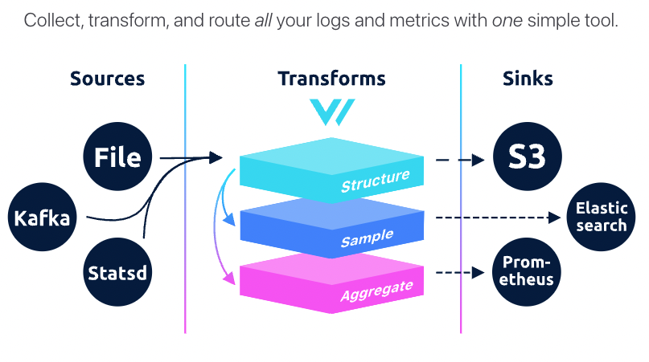

# Vector

import Tabs from '@theme/Tabs';
import TabItem from '@theme/TabItem';

:::note

A high-performance observability data pipeline.

https://vector.dev/
https://github.com/vectordotdev/vector

:::

## TL;DR

В моей текущей инфраструктуре, vector это **агент**, который **собирает логи с pod-ов k8s**, обрабатывает их (парсит в json) и пересылает в [loki](https://github.com/grafana/loki). Т.к. **loki** это не тема статьи, то скажу так: это хранилка и поиск по логам, в качестве UI используется grafana. Таким образом я проведу аналогии с elastic-stack-ом, но это очень грубое сравнение - решения концептуально разные:

## аналогии в компонентах log-stack-ов

| Storage Backend | Agent    | UI      |
|-----------------|----------|---------|
| Elasticsearch   | Logstash | Kibana  |
| Loki            | Vector   | Grafana |

## Concepts



- **sources** - точка входа, откуда vector-у брать логи
- **transforms** - как vector-у обработать логи?
- **sinks** - в какую систему хранения сложить обработанный лог
- **VRL** - язык обработки логов от vector

Есть и прочие вопросы, например deployment: роли vector-а (agent,aggregator) и топологии (HA сетап) которые предлагается изучать самостоятельно :)

## quickstart

Создаем конфиг `vector.toml`

<Tabs defaultValue="stdin">
<TabItem value="stdin" label="stdin">

```toml
# sources - точка входа, откуда vector-у брать логи
[sources.stdin]
type = "stdin"

# transforms - как vector-у обработать логи?
[transforms.remap_syslog]
inputs = [ "stdin"]
type = "remap"
source = '''
  structured = parse_syslog!(.message)
  del(.file)
  del(.host)
  . = merge(., structured)
'''

# sinks - в какую систему хранения сложить обработанный лог
[sinks.stdout]
inputs = ["remap_syslog"]
type = "console"
encoding.codec = "json"
```
</TabItem>

<TabItem value="file" label="file">

```toml
# sources - точка входа, откуда vector-у брать логи
[sources.file]
type = "file"
include = ["/etc/vector/logs"]

# transforms - как vector-у обработать логи?
[transforms.remap_syslog]
inputs = [ "file"]
type = "remap"
source = '''
  structured = parse_syslog!(.message)
  del(.file)
  del(.host)
  . = merge(., structured)
'''

# sinks - в какую систему хранения сложить обработанный лог
[sinks.stdout]
inputs = ["remap_syslog"]
type = "console"
encoding.codec = "json"
```

</TabItem>

</Tabs>

Я запускаю vector в контейнере таким alias-ом, делать это нужно в директории, в которой есть **конфиг**!

```shell
alias vector='docker run -i -v $(pwd)/:/etc/vector/ --rm timberio/vector:0.25.2-debian'
```

Распарсим такой лог, либо сложим его в файл `logs`

```shell
# stdin
echo 'Dec  1 18:15:56 ip-10-51-37-210 kubelet: {"level":"info","ts":"2022-12-01T18:15:56.091Z","caller":"/usr/local/go/src/runtime/proc.go:203","msg":"CNI Plugin version: v1.7.5 ..."}' | vector
# file - just run the container via alias
vector
```

Готово! Результат - мы распарсили syslog в json, удалили пару ненужных полей:

```json
echo '{"appname":"kubelet","hostname":"ip-10-51-37-210","message":"{\"level\":\"info\",\"ts\":\"2022-12-01T18:15:56.091Z\",\"caller\":\"/usr/local/go/src/runtime/proc.go:203\",\"msg\":\"CNI Plugin version: v1.7.5 ...\"}","source_type":"stdin","timestamp":"2022-12-01T18:15:56Z"}' | jq
{
  "appname": "kubelet",
  "hostname": "ip-10-51-37-210",
  "message": "{\"level\":\"info\",\"ts\":\"2022-12-01T18:15:56.091Z\",\"caller\":\"/usr/local/go/src/runtime/proc.go:203\",\"msg\":\"CNI Plugin version: v1.7.5 ...\"}",
  "source_type": "stdin",
  "timestamp": "2022-12-01T18:15:56Z"
}
```
